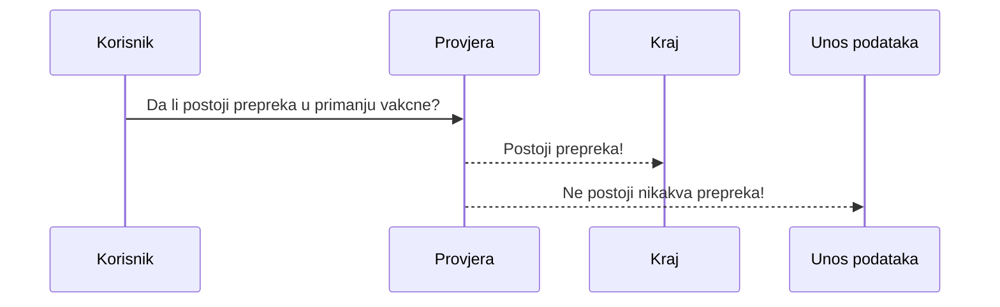

# vd-android-apps

## First app

# Projekat 1 - Aplikacija za prijavu za vakcinaciju

Projekat podrazumijeva razvoj Android aplikacije putem koje će se vršiti simulacija prijava za vakcinaciju.
U nastavku su navedeni detaljni opisi aplikacije i njenih pojedinih dijelova.

### autori: 
- **Isanović Ajša**
- **Delić Vedad**


## Uvodni dio


Na početnom ekranu nalazi se pozdravna poruka, te dugme za nastavak dalje. U pozadini ovog screena se nalazi fragment čija iplementacija osim override onCreateView funkcije sadrži i onclikclistener koji proslijeđuje na naredni screen, odnosno fragment.
```
 binding.idButtonPrijaviSe.setOnClickListener{
            it.findNavController().navigate(R.id.action_uvodniFragment_to_provjeraFragment)
        }
```
> [Kasnije ćemo vidjeti kako smo u ovom dijelu, u App bar- u dodali item i button, koji proslijeđuju u fragment gdje se nalazi opis aplikacije (napomenimo da je fragmentu about jedino moguće pristupiti na ovaj način )

-Sadržaj popratnog .xml fajla za uvodni dio ima jednostavnu strukturu, te se sastoji od:
> TextView
> Button
> ImageView

## Fragment provjere

Ovaj dio aplikacije podrazumijeva provjeru, gdje korisnik unosi ukoliko postoji bilo kakva smetnja u primanju vakcine (npr. alergije i slicno), te ukoliko postoji smetnja bilo kakve vrste korisnik treba da klikne button više informacija kako bi dobio informacije o daljim postupcima inače klika button dalje za nastavak aplikacije.


1. Klikom na button dalje korisnik biva proslijeđen na stranicu unosa ličnih podataka
2. Klikom na button više informacija korisnik biva proslijeđen na stranicu sa porukom da u ovom trenutku zbog stanja u kom se nalazi ne smije primiti vakcinu




> Tehnički osvrt: Unutar provjere, a u layoutu postoje dva buttona. U odgovarajućem kotlin fajlu, postavljena su dva actionlistenera na buttone čijim klikom korisnik biva proslijeđen na odgovarajući naredni fragment u cilju efikasne prijave za vakcinaciju. 

```
 binding.idButtonProvjeraDalje.setOnClickListener{
            it.findNavController().navigate(R.id.action_provjeraFragment_to_podaciFragment)
        }
```
```
   binding.idButtonProvjeraKraj.setOnClickListener{
            it.findNavController().navigate(R.id.action_provjeraFragment_to_krajFragment)
        }
```

## Fragment  kraja
- Fragment kraja predstavlja jedan jednostavni fragment čiji popratni layout sadrži samo jednu poruku, odnosno text view te jedan button čijim klikom bivamo proslijeđeni na sami početak aplikacije.


> Tehnički osvrt: Unutar klase KrajFragment postoji samo override- na on create metoda.

```
override fun onCreateView()
```


## Fragmnet podaci

U ovom fragment uzimamo podatke od korisnika. Sad nam je već od velikog značaja za adekvatnu prijavu uzeti od korisnika lične podatke poput imena, prezimena, broja telefona, JMBG, mjesta prebivališta i datuma rođenja. Osim ovog u ovom dijelu imamo i dio sa checkbox-om u kom korisnik unosi da li pripada nekoj od prioritetnih kategorija pri imunizaciji, poput: zdravstvenih radnika, hroničnih bolesnika ili da pripadaju populaciji osoba treće životne dobi. 


> Checkbox: omogućava korisniku da odabere jednu ili više opcija iz skupa. (primjetimo da u našem slučaju to ima smisla staviti, a ne samo jednu opciju poput radiobutton-a jer jedan korisnik npr. može biti star 75+ godina, ali i ujeno imati i neku od hroničnih bolesti). U oficijelnoj andorid developer dokumentaciji također vezano za checkbox možemo naći da bismo obično trebali svaku opciju predstaviti na okomitom popisu. 


## Fragment izbora željene vakcine
Fragment  izbora željene vakcine ima ulogu da korisniku pruži mogućnost da izabere jednu od vakcina koje postoje. 


- Tehnički osvrt:
> Layout: naime osim text polja ovaj fragment ima malo složeniji izgled od prethodnih. Novost je uvođenje radio button-a koji omogućavaju korisniku da izabere **samo jednu** od ponuđenih vakcina, za razliku od prethodno korištenih checkbox- buttona. Korišten je constraint layout sa uvedenim dijelom linear layout- a

```
Layout

TextView

LinearLayout

RadioButton
RadioButton
RadioButton
RadioButton

Button 
/LinearLayout
/Layout
```


> Fragment: Također, kao što je i ranije bilo govora kod prethodnih fragmenata, unutar klase VakcineFragment nalazi se override metoda onCreateView, jedan binding, te navControler koji nas proslijeđuje narednom fragmentu. Naredni fragment koji nam dolazi je fragment sažetak. O ovom fragmentu će kasnije biti govora.

```
it.findNavController().navigate(R.id.action_vakcineFragment_to_sazetakFragment)
        
```


## Fragment O Aplikaciji 

Ovaj fragment je najsličniji fragmentu kraja koji je ranije opisan iz razloga što se sastoji od samo jednog text polja koje nam govori koja je uloga aplikacije i kako ona može biti primijenjena u stvarnom životu, te na problem koji je danas jedan od najaktuelnijih. 
Za ovaj fragment je specifičan sam pristup njemu iz razloga što se ne može pristupiti sa nekog drugog fragmenta, već je to moguće samo iz bočnog menija kao i iz buttona up-a iz nav trake sa početnog ekrana ( odnosno uvodnog fragmenta).
Popratni kotlin fajl za ovaj fragment nije nipočemu posebno specifičan obzirom da nema nikakvih aktivnosti.


## Fragment sažetak 

Vjerovatno subjektivno mišljenje ali, autorima najvažniji fragment do sada opisan. Ovaj fragment sadrži dosta tehničkih detalja koji će biti opisani. Ali prije svega prezentujmo njegov izgled. (Izgled je namjerno kopiran iz android studia a ne iz emulatora kako bi se funkcionalnost mogla do u detalje opisati)


---

**Novosti:**

1. Safe args prenošenje podataka

> Navigacija nam dozvoljava da dodamo podatke na navigacijske operacije definisanjem argumenata na destinaciji. Na primjer, u našem konkretnom slučaju Fragment sažetak prihvata argumente ime i prezime iz fragmenta podaci te mjesto vackcinacije. Iz fragmenta vakcina prihvaća informaciju o vakcini koju preferira korisnik. Na kraju Ukoliko korisnik pripada nekoj od kritičnih kategorija koje imaju prednost pri vakcinaciji, a na osnovu dodijeljenog argumenta odredit će hitniji datum u odnosu na ostale. Naime ako korisnik pripada kritičnoj kategoriji generisat će mu se random datum u sljedećih 10 dana, dok u suprotnom generisat će se datum u sljedećih 10 do 20 dana. Nakon što smo proslijedili sve neophodno podatke fragmentu sažetak, postavit ćemo ih u odgovarajuća text polja, na sljedeći način

Funkcija koja na osnovu hitnosti bira datum, a na osnovu slučajnog izbora, te vodeći računa da se ne čeka previše (generiše datum unutar narednih nekoliko dana)
`
private fun napraviDatum(kriticnaSkupina : Boolean): String`


---

```
binding.idEditImeIPrezime.setText(ime_prezime)

binding.idEditMjestoVakcinisanja.setText(args.mjesto)

binding.idEditVakcina.setText(args.vakcina)

```

Definisanje argumenta:
`val args=SazetakFragmentArgs.fromBundle(requireArguments())
`

Spajanje imena i prezimena:

        val ime_prezime=args.ime +" "+ args.prezime

Informacija o hitnosti:
`
val kriticnaKategorija=args.kriticnaKategorija`

Određivanje datuma na osnovu hitnosti: 
        `var datum=napraviDatum(kriticnaKategorija)`
        


### U narednom dijelu opisat cemo kako smo implementirali navigacijski meni, share button te tzv. info button.

**Napomena: u naredim rečenicama bit će opisan samo izgled dok će način povezivanja biti opisan na samom kraju.**

## Nav header main
Predstavlja pozadinu za navigacioni menu koji se prikazuje klikom na tri horizontalne linije.


Komponente ovog layout-a su 
- ikona iz vector drawable. Ikona je namjenski promjenjena sa defaultne vrijednosti 24x24 dp na 70x70 te boja je postavljena na zelenu.
- Kao titl u ovom dijelu stoji vakcinacija
- Subtitl je mail adresa na koju se korisnici trebaju obratiti ukoliko dođe do poteškoća pri radu aplikacije.


## Share icona 
Također ikona iz vector drawable. Klikom na ovu ikonu korisniku se otvara niz aplikacija kojima može poslati predefinsanu poruku kojom podržava vakcinaciju, te bodri svoje kontakte da se i oni vakcinišu. Ikona se može vidjeti na slici u prethodnoj sekciji. Dok klikom na istu pojavljuje se: 


Odnosno: 


Te konačno dolazimo do dijela u backendu gdje smo ovo sve omogućili. A to se nalazi u MainActivity sekciji

# Main activity
Za razliku od fragmenata, dijelovi aplikacije koji se ovdje implementiraju odnosno povežu sa aktivnošću vidljivi su tokom čitave aplikacije, odnosno aktivnosti ukoliko ih ima više. U konkretnom slučaju, sve se odvija uz jednu aktivnost. Share button koji smo povezali za MainActivity je vidljiv na svim fragmentima na aplikaciji, te mu se može pristupiti na isti način od početka do kraja. 

```
private fun onShare()
```
> Pri pozivu ove funkcije dolazi do poziva share opcije. Pokreće se izbornik sa jedne od prethodnih slika te se daje korisniku mogućnost izbora aplikacije da podijeli poruku. Ovo je izvedeno koristeći share intent. Intent označava mogućnost prenosa podataka, kako kroz aplikaciju, tako i kroz sistem što je u pitanju u konkretnom slučaju. Tip poruke je postavljen za text, dok je za tekst poruke postavljen tekst po izboru. Također ovo je izvedeno unutar try and catch bloka, te u slučaju da nešto krene po zlu korisniku će se ista poruka ispisati u obliku toast poruke a istu neće biti u mogućnosti direktno poslati (putem intenta).

## Timer 

Brojač koji nam simulira zauzimanje resursa na samom procesoru, te šta se dešava sa njima. Također je implementiran u MainActivity- u. 
Incijaliziramo varijablu Timer tipa Timer
te varijablu brojač tipa int

```
    private lateinit var Timer : Timer

```

Unutar onStart pozivamo super konstruktor onStart iz samog Timera, čime započinje brojanje sekundi aktivnsti aplikacije. Bitno je napomenuti da je ovo vidljivo samo unutar konzole developeru, ali ne i korisniku na aplikaciji.
```
override fun onStart() {
        super.onStart()        ...
        }
```
> Osim dole navedenih "akcija" postoji i još jedna, koja je malo specifičnija od navedenih do sad. Ona je specifična zbog toga što smo za nju vezali brojač posjeta. Naime svaki put prilikom njenog poziva brojač posjeta bi se trebao povećati za jedan. Jasno je da se u ovom momentu to još neće desiti radi nedostatka baze podataka, ali ovim jasno možemo steći sliku u radu samih tajmera i lifecycle-a. Odnosno možemo primjetiti da bi pri pokretanju same aplikacije proces bio pokrenut od strane procesora. To znači da se korisnik prijavio, se brojač prijavljenih povećava za jedan. Ovim se povećava broj prijavljenih korisnika. 

```
@SuppressLint("LongLogTag")
override fun onCreate() {
        brojac++
        super.onCreate()
        Log.i("MainActivity - brojac posjeta:",
        ...
        }
```

U slučaju prekida aplikacije,te potom njenog daljeg nastavka poziva se naredna metoda

```
override fun onResume() {
        super.onResume()
        Log.i("MainActivity","onResumeCalled")
    }
```

Na pauziranju aplikacije 

```
 override fun onPause() {
        super.onPause()
        Log.i("MainActivity","onPauseCalled")
    }
```

Analogno opisanom imamo dešavanja na restartu i uništavanju
```
    override fun onDestroy() {
        super.onDestroy()
        Log.i("MainActivity","onDestroyCalled")
    }

    override fun onRestart() {
        super.onRestart()
        Log.i("MainActivity","onRestartCalled")
    }
```

> OnStop

```
    override fun onStop() {
        super.onStop()
        Log.i("MainActivity","onStopCalled")
         brojac.toString())

    }
```
Tajmeru u main Activity proslijeđujemo trenutni lifecycle. Da je riječ o trenutnom možemo vidjeti budući da smo koristili ključnu riječ ***this***
 ```
 Timer = Timer(this.lifecycle)
        ...

        }
        
```

Ovdje smo uveli potrebne pojmove. Detaljnije ih objašnjavamo u narednom paragrafu. 

## Klasa Timer
Naime ranije smo već uveli tajmer. Sad se susrećemo sa implementacijom same klase. Na samom početku postavljamo brojač sekundi na nule te Handler koji ima za cilj interakciju sa samim operativnim sistemom. Iz predmeta operativni sistemi znamo da android kao i svaki drugi os radi na low-level nivou. Glavni zadatak mu je da obrađuje sučelje s perifernim hardverom, raspoređuje zadatke, dodjeljuje pohranu i predstavlja zadano sučelje korisniku kada nije pokrenut nijedan aplikacijski program. Sada nakon manje digresije vratimo se našoj klasi i objasnimo šta je njen cilj. Cilj klase jeste da nam, kao developerima, da informaciju o načinu na koji os pristupa našoj aplikaciji. Koliko dugo troši resurse na nju, te nakon što je zatvorimo šta biva. Već smo rekli, da pri zatvaranju poziva se onDestroy čime se svaki resursi zauzeti aplikacijom oslobađaju, pa i tajmer staje ( jasno je da tajmer predstavlja ovdje zauzeće resursa uređaja od strane naše aplikacije) odnosno imamo slikovit dokaz da su resursi zaista oslobođeni. O samoj strukturi os- a, detaljima kako se vrši oslobađanje i opisom jezgri koje su zahvaćene u ovom radu nećemo govoriti, budući da bi se previše udaljili od teme. Ali ćemo opisati osnovni lyfecycle:

1. onCreate()

> Poziva se kad je aktivnost prvi put pozvana. Ovdje je odrađen statički posao kao kreiranje view- ova, povezivanje podataka sa listama i itd.

2. onStart() 

> Poziva se kad je aplikacija pokrenuta i aktivnost vidljiva korisniku. Dolazi nakon onResume() ako je aplikacija pozvana iz stanja mirovanja ili onCreate() ako je prvi put pozvana.

3. onRestart() 

> Poziva se uvijek nakon onStart() a nakon što aplikacija biva ponovo pozvana iz pozadinskog procesa.đ

4. onResume() 

> Poziva se nakon što korisnik počinje interakciju sa aplikaciom. U ovom trenutku nalazi se na vrhu activity stack- a. Dolazi nakon onPause() kad aktivnost ide u pozadinu ili biva zatvorena od strane korisnika. 

5. onStop()

> Poziva se nakon što aktivnost više nije vidljiva korisniku. Nakon nje obično dolaze onRestart() ukoliko se aktivnost ponovo poziva iz pozadine odnosno onDestroy() kad je aktivnost uništena. Primjetimo da do pozivanja posljednje metode ne mora nužno doći, ali to može proizvesti situaciju da dođe do nedostatka memorije (RAM), ako je proces onPause() on svakako troši manje memorije ali ipak troši određeni dio. Ukoliko imamo previše procesa onPause() može doći do nedostatka memorije, te nepredviđenih dešavanja budući da sam os nema pravo samostalno "ubiti" neki proces. Moguće je izazvati katozvani "freez ekrana" odnosno sporo reagovanje, nemogućnost pokretanja novih aplikacija (opa. aktivnosti), te preporuke da neke ugasimo. 

6. onDestroy()

> Konačni poziv prije aktivnost je uništena. To se može dogoditi ili zato što se aktivnost završava (kada se pozove finish () ili zato što sistem privremeno uništava ovu instancu aktivnosti radi uštede prostora. Da biste razlikovali ove scenarije, provjerite je metodom isFinishing ().

### Prevod 
Na kraju dotaknimo se na kratko i prevoda Čitave aplikacje na 2 jezika uz treći orginalni. Ovo je postignuto tako što u samim layoutima nismo direktno pisali text odnosno nazive. Već smo linkovali na string folder unutar Values sve nazive i textove. Na kraju u opciji translate unutar stringova dodani su različiti jezici engleski i njemački. Svaka vrijednost unutar stringa mora biti definisana sad i u prevodilačkim folderima. Na kraju bira se jedan od jezika u aplikaciji na osnovu jezika uređaja. Tako ukoliko je korisniku podešen jezik na uređaju njemački aplikacija automatski prikazuje njemačku verziju. Analogno vrijedi i za engleski jezik. Dok koliko je jezik podešen npr na Italijanski prikazat će se verzija na maternjem BHS jeziku (jer u postavkama emulatora ne postoji izbor za Bosanski jezik).

### Uklanjanje fragmenata sa backtrack- a

Podrazumijeva vraćanje aplikacije sistemskim buttonom back na sami početak aplikacije. Inače aplikacije bi se vraćala unazad samo jedan fragment, ali budući da se radi sa unosom podataka na ovaj način preporučeno je ukloniti sa backtrack- a. Ukoliko pak želimo se vratiti samo jedan fragment unazad to je moguće preko strelice nazad u meniju.

###### izvor: https://developer.android.com/guide/

